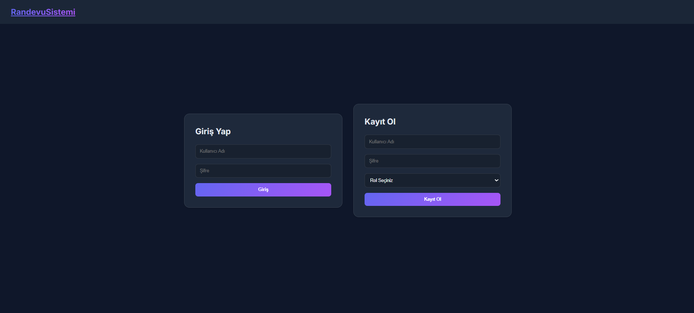
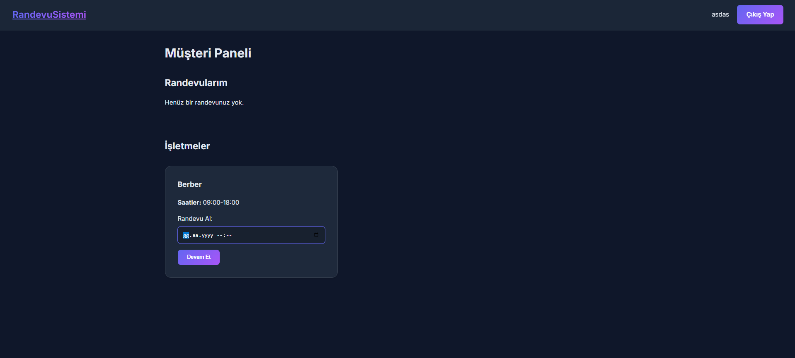
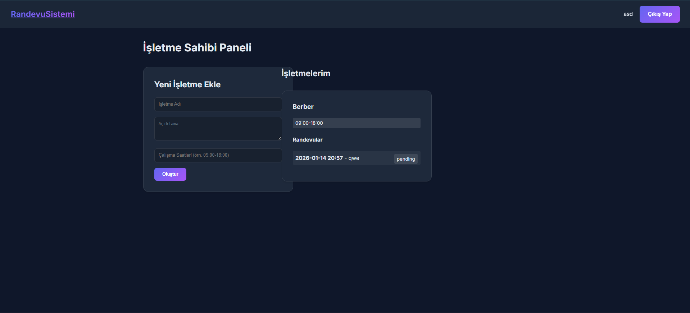

# 📅 Online Randevu Sistemi

> Flask tabanlı, rol bazlı yetkilendirme sistemiyle güçlendirilmiş modern online randevu yönetim platformu.

---

## 📸 Ekran Görüntüleri


| Giriş Ekranı | Müşteri Paneli | İşletme Sahibi Paneli |
|:---:|:---:|:---:|
|  |  |  |

---

## 🚀 Özellikler

- 🔐 **Güvenli Kimlik Doğrulama** — Kayıt ve giriş işlemleri şifreli parola hash'i (Werkzeug) ile korunmaktadır
- 👥 **Rol Bazlı Yetkilendirme** — `owner` (işletme sahibi) ve `customer` (müşteri) olmak üzere iki ayrı kullanıcı rolü
- 🏢 **İşletme Yönetimi** — Sahipler işletmelerini oluşturabilir, açıklama ve çalışma saatlerini tanımlayabilir
- 📆 **Randevu Oluşturma** — Müşteriler mevcut işletmelerden tarih/saat seçerek randevu alabilir
- ✅ **Randevu Durum Takibi** — Randevular `pending`, `confirmed`, `cancelled` statüleriyle izlenir
- 💾 **SQLite Veritabanı** — Geliştirme ortamında sıfır konfigürasyonla çalışır

---

## 🛠️ Kullanılan Teknolojiler

| Katman | Teknoloji |
|--------|-----------|
| **Backend** | Python 3, Flask 3.1.2 |
| **ORM** | Flask-SQLAlchemy 3.1.1 |
| **Auth** | Flask-Login 0.6.3, Werkzeug 3.1.4 |
| **Veritabanı** | SQLite (geliştirme), MySQL desteği mevcut |
| **Template** | Jinja2 3.1.6 |
| **Frontend** | HTML5, CSS3 |

---

## 📁 Proje Yapısı

```
appointment-system/
│
├── app.py                  # Ana uygulama, route tanımları
├── models.py               # Veritabanı modelleri (User, Business, Appointment)
├── requirements.txt        # Python bağımlılıkları
├── test_setup.py           # Test kurulum dosyası
│
├── templates/
│   ├── base.html           # Temel şablon
│   ├── auth.html           # Giriş / Kayıt sayfası
│   ├── owner_dashboard.html    # İşletme sahibi paneli
│   └── customer_dashboard.html # Müşteri paneli
│
└── static/
    └── style.css           # Uygulama stilleri
```

---

## ⚙️ Kurulum

### Gereksinimler

- Python 3.8+
- pip

### Adımlar

```bash
# 1. Repoyu klonla
git clone https://github.com/yigitcaglayan/appointment-system.git
cd appointment-system

# 2. Sanal ortam oluştur ve aktif et
python -m venv venv

# Windows
venv\Scripts\activate

# macOS / Linux
source venv/bin/activate

# 3. Bağımlılıkları yükle
pip install -r requirements.txt

# 4. Uygulamayı başlat
python app.py
```

Uygulama varsayılan olarak `http://127.0.0.1:5000` adresinde çalışacaktır. İlk çalıştırmada SQLite veritabanı ve tablolar otomatik olarak oluşturulur.

---

## 🗃️ Veritabanı Modelleri

```
User
├── id (PK)
├── username (unique)
├── password_hash
└── role → "owner" | "customer"

Business
├── id (PK)
├── owner_id (FK → User)
├── name
├── description
└── working_hours

Appointment
├── id (PK)
├── business_id (FK → Business)
├── customer_id (FK → User)
├── date_time
└── status → "pending" | "confirmed" | "cancelled"
```

---

## 🔗 API / Route'lar

| Method | Endpoint | Açıklama |
|--------|----------|----------|
| `GET` | `/` | Ana sayfa / yönlendirme |
| `POST` | `/login` | Kullanıcı girişi |
| `POST` | `/register` | Yeni kullanıcı kaydı |
| `GET` | `/logout` | Oturum kapatma |
| `GET` | `/dashboard/owner` | İşletme sahibi paneli |
| `GET` | `/dashboard/customer` | Müşteri paneli |
| `POST` | `/business/create` | Yeni işletme oluşturma |
| `POST` | `/book/<business_id>` | Randevu oluşturma |

---

## 👨‍💻 Geliştirici

<table>
  <tr>
    <td align="center">
      <a href="https://github.com/yigitcaglayan">
        <br/>
        <sub><b>Yiğit Çağlayan</b></sub>
      </a>
    </td>
  </tr>
</table>

---

## 📄 Lisans

Bu proje [MIT Lisansı](LICENSE) ile lisanslanmıştır.
